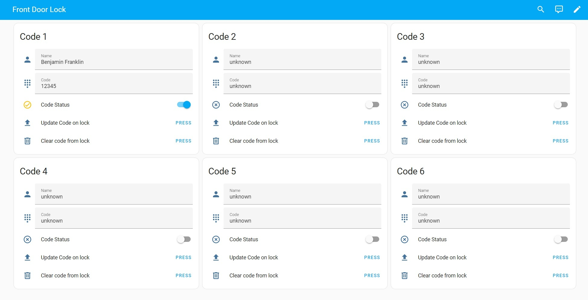

# Zigbee Lock Manager
[![GitHub Release][releases-shield]][releases]
[![hacs][hacsbadge]][hacs]

This Home Assistant integration provides a dashboard for managing lock codes on Zigbee keypad locks.  Installation dynmically creates the helpers, automations, and dashboard YAML, based on the number of codes (slots) the user wants to manage.  

This integration was inspired by [KeyMaster](https://github.com/FutureTense/keymaster) for Z-Wave locks.  Maybe someday this can be updated to provide the same feature parity. 

**Currently this only supports ZHA (Zigbee Home Automation) in Home Assistant.  It does not support Zigbee2MQTT at this time. 

## Features
* Generates helers and dashboard cards for each code slot
* Disable/Enable code slot
* Update code on lock
* Clear code from lock



## Installation

The easiest way to install is through HACS. This integration is already included in the HACS default repositories.

1. In Home Assistant, select HACS -> Integrations -> + Explore and Download Repositories. Search for Zigbee Lock Manager in the list and add it.
2. Restart Home Assistant
3. Set up and configure the integration: [](https://my.home-assistant.io/redirect/config_flow_start/?domain=zigbee_lock_manager)

## Manual Installation

Copy the `custom_components/zigbee_lock_manager` directory to your `custom_components` folder. Restart Home Assistant, and add the integration from the integrations page.

This installation creates helpers from YAML templates stored in /config/packages/zigbee_lock_manager.  You must have the following in your configuration in order for this to work. 

```YAML
homeassistant:
  packages: !include_dir_named packages
```

## Configuration

At this time the integration is only designed to manage the codes for a single lock.  To manage codes for multiple ZHA locks, you can create multiple instances of this integration, but they'll each have their own respsective input helpers. 

*While your lock may support 100 or more lock codes, it is recommended to choose 12-24 slots for optimal UI appearance and performance. The generated YAML was designed for Masonry layouts, and three cards fit nicely to a row.  For your dashboard OCD, choose a number of slots divisible by three. 

Slots: `# of code slots you want to manage` <br>
Lock: `entity_id of your ZHA keypad lock`

While not require, after install it's a good practice to reload YAML (Developer Tools > YAML > "ALL YAML CONFIGURATION") to ensure all changes are picked up and will be actionable. 

## Dashboard creation
Copy the YAML from: <br>
config/packages/zigbee_lock_manager/zigbee_lock_manager_dashboard <br><br>
Create a new dashboard, edit the raw config (three dots after enabling edit), and paste in the YAML from your clipboard.
Done.


[hacs]: https://hacs.xyz
[hacsbadge]: https://img.shields.io/badge/HACS-Default-41BDF5.svg?style=for-the-badge
[releases-shield]: https://img.shields.io/github/v/release/Fiercefish1/zigbee-lock-manager.svg?style=for-the-badge
[releases]: https://github.com/Fiercefish1/Zigbee-Lock-Manager/releases
